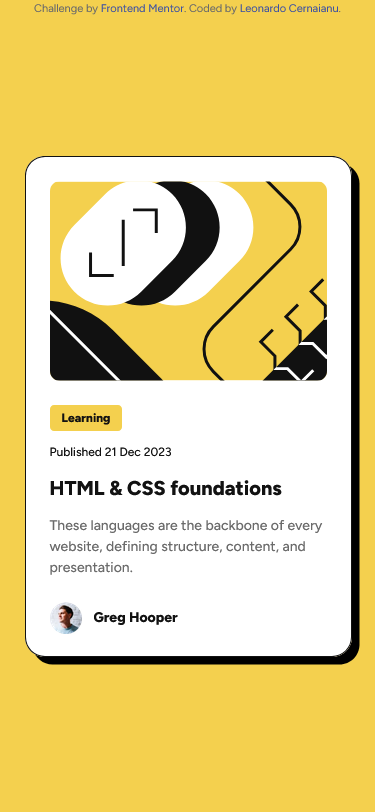

# Frontend Mentor - Blog preview card solution

This is a solution to the [Blog preview card challenge on Frontend Mentor](https://www.frontendmentor.io/challenges/blog-preview-card-ckPaj01IcS). Frontend Mentor challenges help you improve your coding skills by building realistic projects. 

## Table of contents

- [Overview](#overview)
  - [The challenge](#the-challenge)
  - [Screenshot](#screenshot)
  - [Links](#links)
- [My process](#my-process)
  - [Built with](#built-with)
  - [What I learned](#what-i-learned)
- [Author](#author)

## Overview

### The challenge

Users should be able to:

- See hover and focus states for all interactive elements on the page

### Screenshot



### Links

- Solution URL: [https://github.com/Leonardo76/blog-preview-card-main.git](https://github.com/Leonardo76/blog-preview-card-main.git)
- Live Site URL: [https://blogpreviewcardcodechallengefm.netlify.app](https://blogpreviewcardcodechallengefm.netlify.app)

## My process

### Built with

- Semantic HTML5 markup
- CSS custom properties
- SCSS
- Flexbox
- Mobile-first workflow

### What I learned

Sometimes, Figma and CSS don't match. The Blog image cannot look like in Figma without setting 
```css
.element {
    object-fit: cover;
}
```
even if in Figma is set to
```css
.element {
    object-fit: fill;
}
```

It is better to place style.css near the index.html in order the browsers to find it easier.
They don't know to read paths like "/app/css/style.css". You must write them with the dot (like "./app/css/style.css").

Sometimes, browser have problems with importing fonts from local PC. 
## Author

- Frontend Mentor - [@Leonardo76](https://www.frontendmentor.io/profile/Leonardo76)